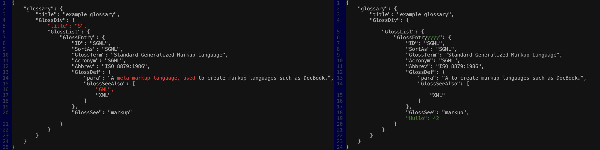

# ocdiff

Fast and simple side-by-side diff library for Python - wraps [similar](https://crates.io/crates/similar), inspired by [icdiff](https://github.com/jeffkaufman/icdiff).

# Usage

```shell
pip install ocdiff
```

```python
ocdiff.html_diff(
    a: str,
    b: str,
    context_lines: int | None = None,
    max_total_width: int | None = None,
) -> str
```

```python
ocdiff.console_diff(
    a: str,
    b: str,
    context_lines: int | None = None,
    max_total_width: int | None = None,
) -> str
```

# Example Output



# CLI usage

```shell
ocdiff a.txt b.txt
```

# Usage in `pytest` with [rich](https://github.com/Textualize/rich)

In your `conftest.py`, add:

```python
import ocdiff
import ocdiff.helpers
import rich.console

def rich_repr(o: Any) -> str:
    string_io = io.StringIO()
    rich.console.Console(
        file=string_io,
        width=ocdiff.helpers.terminal_width() // 2 - 10,
        tab_size=4,
        no_color=True,
        highlight=False,
        log_time=False,
        log_path=False,
    ).print(o)
    string_io.seek(0)
    return string_io.getvalue()


def pytest_assertrepr_compare(config: Any, op: str, left: Any, right: Any) -> list[str] | None:
    very_verbose = config.option.verbose >= 2
    if not very_verbose:
        return None

    if op != "==":
        return None

    try:
        if abs(left + right) < 100:
            return None
    except TypeError:
        pass

    try:
        if isinstance(left, str) and isinstance(right, str):
            pretty_left = left
            pretty_right = right
        else:
            pretty_left = rich_repr(left)
            pretty_right = rich_repr(right)
        return ocdiff.console_diff(
            pretty_left,
            pretty_right,
            context_lines=10,
            max_total_width=ocdiff.helpers.terminal_width() - len("E     "),
        ).splitlines()
    except Exception:
        return None
```

<br>
<hr>
<br>

# Install/Develop

```shell
uv pip install -e '.[dev]'
maturin develop
```

# Make release

- Add pypi token and user = `__token__` to settings (do this once).
- Upversion `pyproject.toml`.

```shell
git tag -a v0.0.x head -m v0.0.x
git push origin v0.0.x
```

# TODO

- Add pytest plugin magic that plays with `rich`.
- Write some docs.
- Allow configuring everything.
- Convert all hex to RGB.
